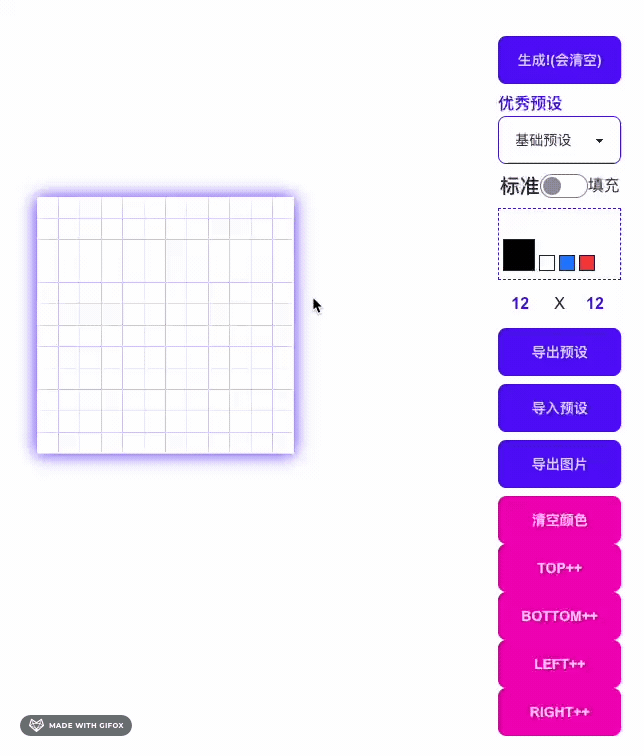

<div align='center'>
<h1>Pixeled Pic Pro </h1>

</div>

<p align='center'>
关注公众号: 早早集市
<br/>
查看相关实战文章
</p>

[点击查看版本更新](https://github.com/zzdaddy/PixeledPicPro?tab=readme-ov-file#%E7%89%88%E6%9C%AC%E6%9B%B4%E6%96%B0) 或直接拉到最底部

## 最新功能
- 基于Konva(目前)
- 生成自定义行x列的方格子
- Toast组件
- 鼠标模式:标准/填充  填充时可上色, 标准时可拖拽
- 空格键切换颜色
- 导出图片

### 功能预览(最初版)
[在线体验最新版](https://zzstudio.cn/stall/pixeled-pic-pro/#/home)



### 基于模版
[boot-vue](https://github.com/kirklin/boot-vue)
点击查看目录结构, 以及基于哪些插件打造

### 开发

运行后打开 http://localhost:8888

```bash
pnpm run dev
```

### 打包

run

```bash
pnpm run build
```

And you will see the generated file in `dist` that ready to be served.


### Deploy on Netlify

Go to [Netlify](https://app.netlify.com/start) and select your clone, `OK` along the way, and your App will be live in a minute.

### Docker Production Build

First, build the boot-vue image by opening the terminal in the project's root directory.

```bash
docker buildx build . -t viteboot:latest
```

Run the image and specify port mapping with the `-p` flag.

```bash
docker run --rm -it -p 8080:80 viteboot:latest
```

## 版本更新

### v0.8.1
- 从此版本开始，核心插件从 Konva 切换到了 Leafer，分支切换到了 Leafer（不日将变更为 master）
- 此分支不再更新！

### v0.8.0
- Toast组件可以被重复使用
- 增加了一个Select组件
- 增加预设功能, 现在可以一键使用预设 ~
- 增加预设导出功能, 把自己的预设内容分享给伙伴 !
- 增加预设导入功能, 一键导入别人的预设(拿来吧你)!
- 调整了按钮顺序, 防止生成按钮误触(和导出按钮混淆)
- 增加导出图片时可选择去除边框功能!


### v0.7.0
- 格式化代码/优化代码
- 现在支持自定义行列数量
- 增加了一个Toast组件
- 切换颜色快捷键由 "Tab" 变更为 "Space" 空格键. 因为Tab键有一些默认行为导致冲突

### v0.6.0
实现了基本功能
